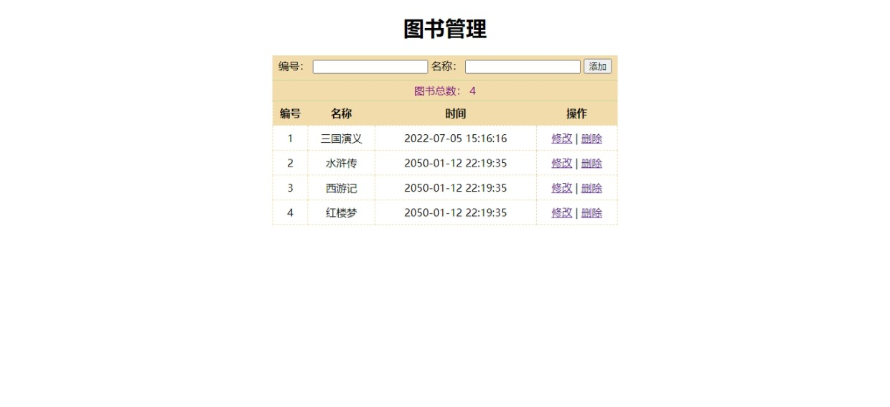

# 图书管理
* [技术👵](#技术)
* [截图👳‍](#截图)
* [功能🎅](#功能)
* [Tree🌵](#tree)
## 技术👵

[](https://github.com/Vogadero/bookManagement)+++++++++

## 截图👳‍♂️



## 功能🎅

| 功能         |
| ------------ |
| 展示图书列表 |
| 添加图书     |
| 删除图书     |
| 编辑图书     |

## Tree🌵 
```
图书管理
   ├─ api.http
   ├─ data.json
   ├─ img
   │  └─ 01.jpeg
   ├─ index.js
   ├─ package-lock.json
   ├─ package.json
   ├─ public
   │  ├─ css
   │  │  └─ index.css
   │  ├─ js
   │  │  ├─ axios.js
   │  │  └─ vue.js
   │  └─ 图书管理.html
   ├─ README.md
   ├─ router.js
   ├─ service.js
   └─ 接口文档.md
```
